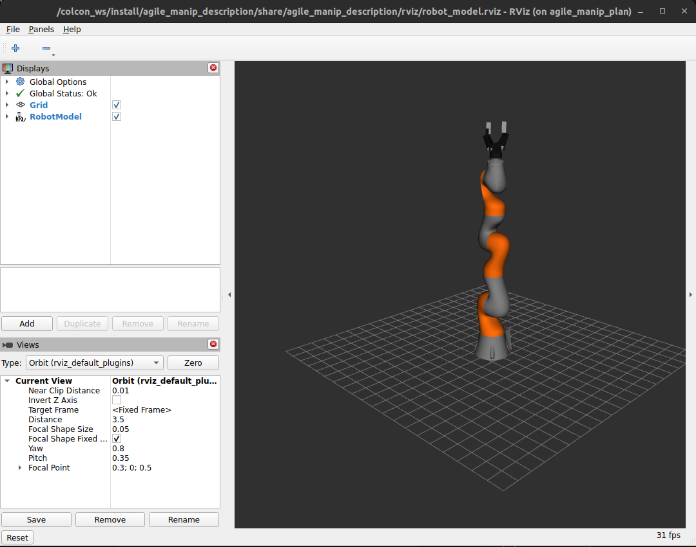
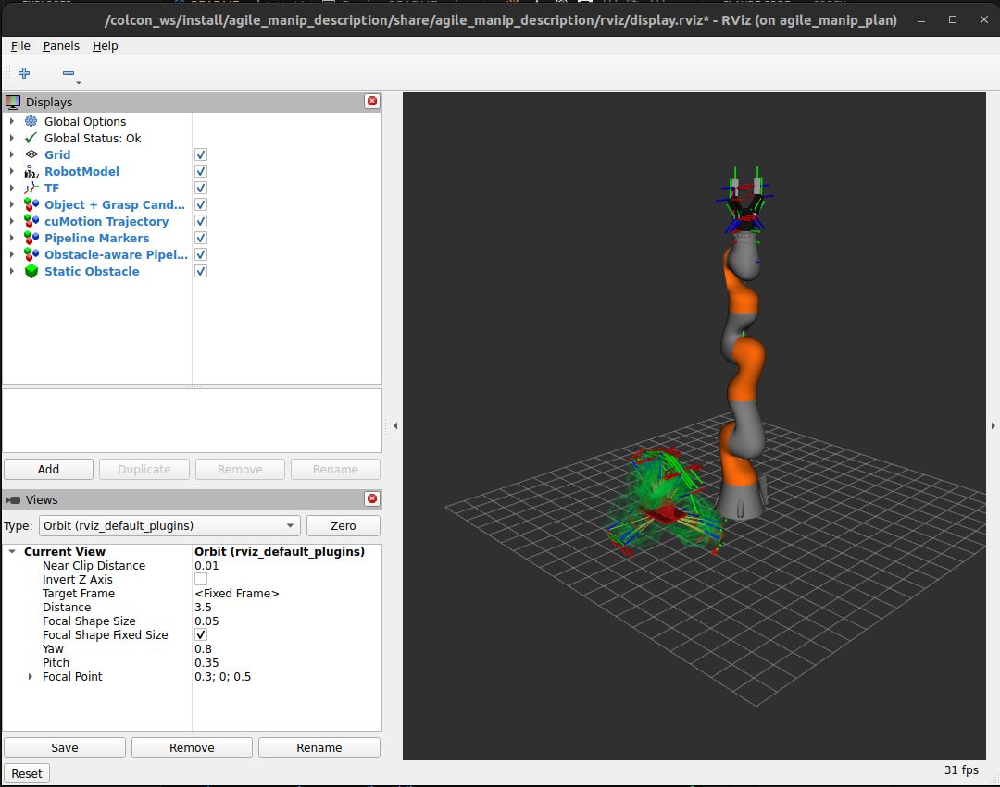
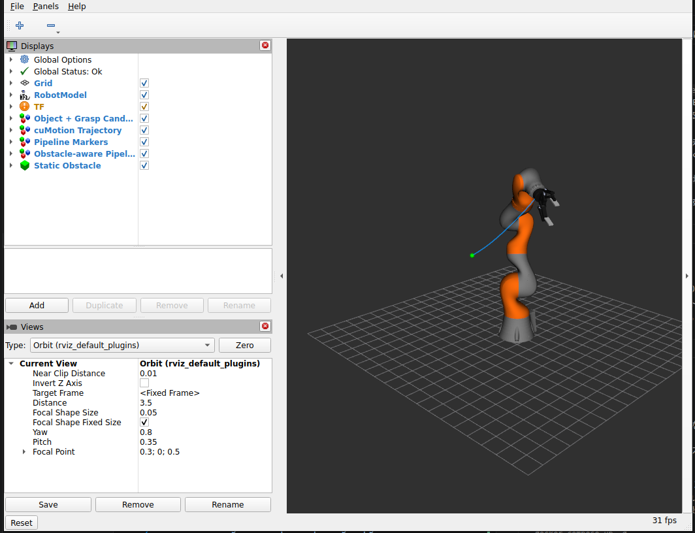
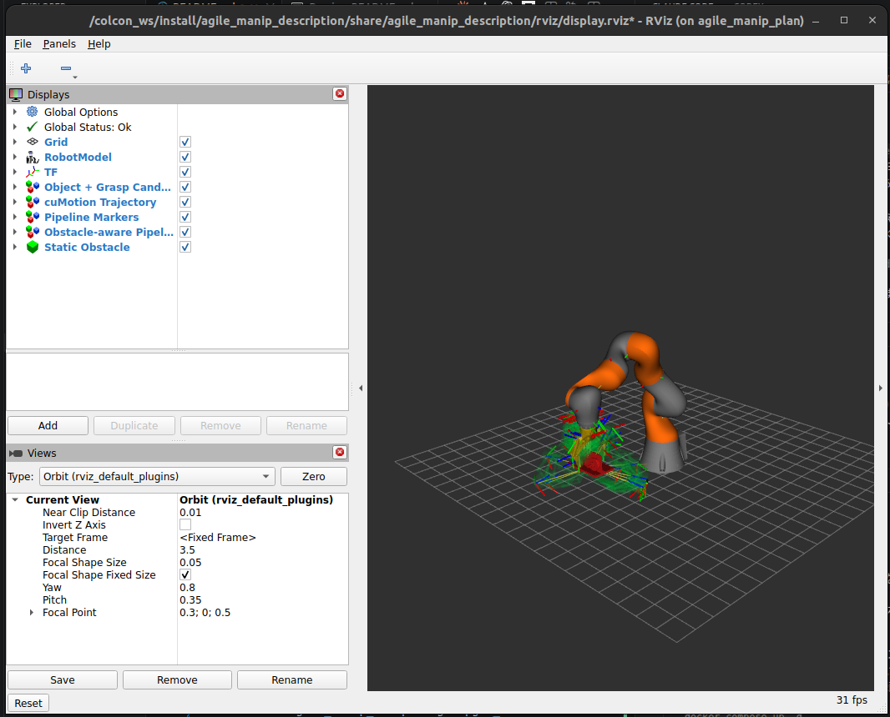
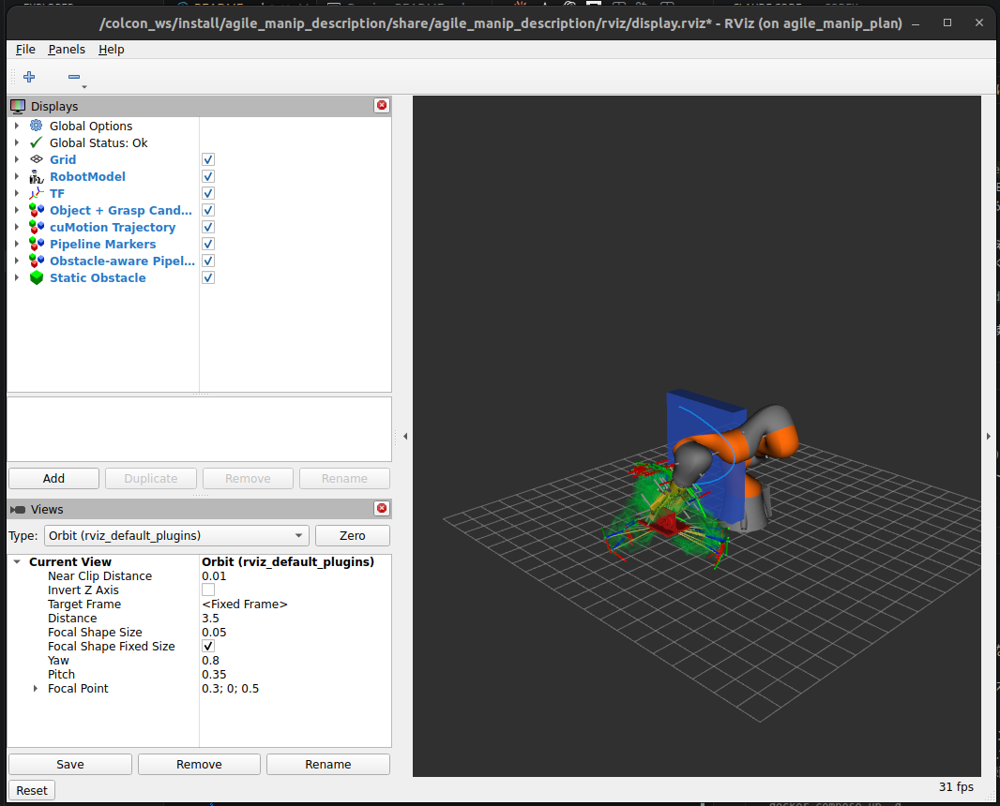
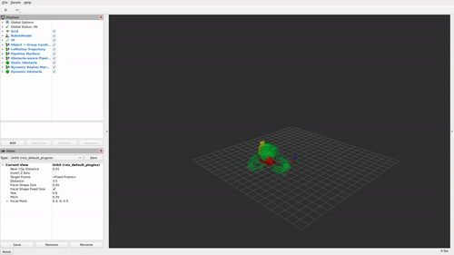

# agile_manip_plan

[](LICENSE)

ROS 2 example programs and Docker environment for agile manipulation planning with an LBR iiwa 14 R820 and Robotiq 2F-140 gripper. This repository integrates [GraspGen](https://github.com/UOsaka-Harada-Laboratory/graspgen_ros) for GPU-accelerated grasp generation and [Isaac ROS cuMotion](https://github.com/NVIDIA-ISAAC-ROS/isaac_ros_cumotion) for CUDA-accelerated trajectory planning via MoveIt 2.

## Features

- **GraspGen demo**: real `/generate_grasp` service call with grasp TF collection
- **cuMotion demo**: real `cumotion/move_group` planning request with trajectory replay
- **Integrated pipeline**: GraspGen grasp generation → selected grasp pose → cuMotion trajectory planning
- **Obstacle-aware pipeline**: GraspGen + cuMotion with a static box obstacle injected into the MoveIt planning scene, producing a visibly different detour trajectory compared with the obstacle-free pipeline
- **Dynamic replanning pipeline**: continuously replans around a moving box obstacle at several Hz -- either driven by an external pose topic or an internal oscillator -- and pushes the latest trajectory to RViz every tick

## Dependencies

### Software

- [Ubuntu 24.04](https://releases.ubuntu.com/noble/)
- [Docker 27.4.1](https://docs.docker.com/engine/install/ubuntu/)
- [Docker Compose 2.32.1](https://docs.docker.com/compose/install/)
- [NVIDIA Container Toolkit](https://docs.nvidia.com/datacenter/cloud-native/container-toolkit/latest/install-guide.html)

### GPU (tested)

| GPU | Architecture | VRAM | CUDA | NVIDIA Driver |
| --- | --- | --- | --- | --- |
| NVIDIA GeForce RTX 3090 | Ampere | 24 GB | 12.6 | 560+ |
| NVIDIA GeForce RTX 4090 | Ada Lovelace | 24 GB | 12.6 | 560+ |

> **Minimum**: NVIDIA Ampere or later with 8 GB VRAM.

### Hardware

- [KUKA LBR iiwa 14 R820](https://www.kuka.com/en-us/products/robotics-systems/industrial-robots/lbr-iiwa)
- [Robotiq 2F-140](https://robotiq.com/products/2f85-140-adaptive-robot-gripper)

## Installation

```bash
git clone --recursive https://github.com/takuya-ki/agile_manip_plan.git
cd agile_manip_plan
COMPOSE_DOCKER_CLI_BUILD=1 DOCKER_BUILDKIT=1 docker compose build --parallel
```

`graspgen_ros` is the only Git submodule (hence `--recursive`). The
Isaac ROS trees (`isaac_ros_cumotion` with nested `curobo`, `isaac_ros_common`,
`isaac_manipulator`) are cloned directly into `/colcon_ws/src/` by
[docker/Dockerfile](docker/Dockerfile) at image-build time; `docker-compose.yaml`
bind-mounts only the host-editable local packages (`agile_manip_description`,
`agile_manip_examples`, `agile_manip_moveit_config`,
`robotiq_2f_gripper_description`, `graspgen_ros`) over the workspace, so the
Isaac sources baked into the image stay visible at runtime without any
entrypoint or symlink bootstrap.

## Usage

Start the container and enter it:

```bash
docker compose up -d
docker exec -it agile_manip_plan_container bash
```

`colcon build` runs automatically on container startup, so the workspace is ready as soon as you enter.

### Backend management (on the host)

Every demo except the plain robot-model visualization talks to a
GraspGen service and the cuMotion `MoveGroup` action server, each
running in its respective container. Two host-side helpers manage
their lifecycle so you don't have to remember the `docker exec`
incantations:

```bash
bash utils/start_backends.sh   # launch GraspGen + cuMotion, pre-warm grasps
bash utils/stop_backends.sh    # clean shutdown (pkill -9 + retry)
```

`start_backends.sh` calls `/generate_grasp` once at the end so the
resulting grasp TF frames and `MarkerArray` are ready on latched
topics; every demo client then reuses the same grasp set instead of
invoking GraspGen again. Iterate on one demo by running
`bash utils/run_<demo>_demo.sh` while the backends are up, and stop
them with `stop_backends.sh` when finished.

Each demo lists both the host wrapper (`bash utils/run_<demo>_demo.sh`,
runs from the repository root) and the equivalent `ros2 launch`
command you would issue from inside the container (`docker exec -it
agile_manip_plan_container bash`).

### 1. Robot model visualization

No backends needed.

</img>

```bash
# host
bash utils/run_display_demo.sh
# container
ros2 launch agile_manip_description display.launch.py
```

### 2. GraspGen demo

Requires the GraspGen backend (`bash utils/start_backends.sh`). Calls
the real `/generate_grasp` service and republishes the grasp TFs as a
`PoseArray`. The `graspgen_ros` source tree is tracked as a git
submodule.

</img>

```bash
# host (antipodal is the default; pass ``suction`` to switch)
bash utils/run_graspgen_demo.sh
bash utils/run_graspgen_demo.sh suction
# container
ros2 launch agile_manip_examples graspgen_demo.launch.py
ros2 launch agile_manip_examples graspgen_demo.launch.py \
    config:=$(ros2 pkg prefix agile_manip_examples)/share/agile_manip_examples/config/graspgen_suction.yaml
```

### 3. cuMotion demo

Requires the cuMotion `MoveGroup` action server from
`bash utils/start_backends.sh`. Sends a real
`moveit_msgs/action/MoveGroup` request and replays the returned
trajectory in RViz.

</img>

```bash
# host
bash utils/run_cumotion_demo.sh
# container
ros2 launch agile_manip_examples cumotion_demo.launch.py
```

### 4. Integrated grasp + motion planning pipeline

Requires both backends. Calls GraspGen for candidate grasp TFs,
selects one pose, and asks cuMotion for a trajectory plan to it.

</img>

```bash
# host
bash utils/run_grasp_and_motion_demo.sh
# container
ros2 launch agile_manip_examples grasp_and_motion_demo.launch.py
```

### 5. Obstacle-aware pipeline

Requires both backends. Attaches a static box `CollisionObject` to
each cuMotion goal via
`MoveGroup.Goal.planning_options.planning_scene_diff` so cuRobo's
world-collision model includes it, producing a visibly different
detour trajectory compared with the obstacle-free pipeline.

</img>

```bash
# host
bash utils/run_obstacle_aware_demo.sh
# container
ros2 launch agile_manip_examples obstacle_aware_demo.launch.py
```

### 6. Dynamic replanning pipeline

Requires both backends. A moving box obstacle (driven by the node's
internal sinusoidal oscillator by default, or by any external
publisher on `/dynamic_obstacle/pose`) is attached to a fresh
cuMotion goal at `replan_rate_hz` (default 5 Hz). The robot is held
at the home pose; only the planned trajectory -- the blue line
strip -- morphs as the obstacle sweeps, so the replanning cadence is
visible in RViz.

</img>

```bash
# host
bash utils/run_dynamic_replan_demo.sh
# container
ros2 launch agile_manip_examples dynamic_replan_demo.launch.py
```

Override the replan rate or obstacle motion from the command line:

```bash
ros2 launch agile_manip_examples dynamic_replan_demo.launch.py \
    config:=$(ros2 pkg prefix agile_manip_examples)/share/agile_manip_examples/config/dynamic_replan.yaml
```

(or pass `-p replan_rate_hz:=8.0` etc. directly to
`ros2 run agile_manip_examples dynamic_replan_planner`.)

## Benchmark

A headless [`benchmark_harness`](colcon_ws/src/agile_manip_examples/agile_manip_examples/benchmark_harness.py)
node replays the GraspGen + cuMotion plan request `iterations` times
and writes per-iteration metrics (planning time, waypoints, trajectory
length, final residual, error code) to a CSV. Use it to quantify the
"ultra-fast planning" claim and to compare grasp-selection strategies
on a common workload.

### Results

Planning-only timing (cuMotion pose goal from home joint configuration
to a GraspGen pose, 20 iterations, single pre-warmed grasp set of 32
candidates). Hardware: **NVIDIA GeForce RTX 3090 (24 GB, CUDA 12.6)**.

Two strategies are compared for choosing *which* GraspGen candidate to
plan to (both use the same cuMotion planner with identical settings):

- **Confidence-first**: sort by GraspGen confidence, try the highest
  score first -- the default in existing launches.
- **Multi-criteria**: weighted score combining GraspGen confidence
  with a reachability sub-score that favours grasps inside the
  iiwa14's comfortable reach envelope (peaks at 0.5 m from the base,
  smoothly decaying with a cosine window). Weights are ROS
  parameters; both terms are intentionally task-agnostic.

*On confidence*: this is not a value this repository computes.
GraspGen's own neural network outputs a success-probability estimate
in `[0, 1]` for every candidate it generates; those values are
written out alongside the grasp poses to the YAML at
`grasp_result_path` (e.g.
`/colcon_ws/src/graspgen_ros/share/grasp_result/example_mesh_antipodal.yaml`),
and [`load_grasp_scores`](colcon_ws/src/agile_manip_examples/agile_manip_examples/graspgen_utils.py)
just reads them. The score reflects what GraspGen's model learned
about grasp stability on the object mesh.

| Grasp selection strategy        | success | median (ms) | mean (ms) | p95 (ms) | min-max (ms)   | median traj. length (m) | max residual (mm) |
|---------------------------------|---------|-------------|-----------|----------|----------------|-------------------------|-------------------|
| Confidence-first                | 20/20   | **192.1**   | 193.2     | 211.1    | 180.8 – 211.5  | 0.662                   | 0.01              |
| Multi-criteria (conf + reach)   | 20/20   | **160.3**   | 168.2     | 201.4    | 153.4 – 201.6  | 0.585                   | 0.01              |

Both strategies land within 0.01 mm of the requested pose. Total
per-cycle time is dominated by the MoveGroup action round-trip (the
cuMotion solve itself is well below that budget). In this scene
Multi-criteria picks a reach-biased grasp that yields a shorter
trajectory and a faster overall plan on the median, illustrating
that confidence alone does not always pick the cheapest candidate;
tuning `multi_criteria_weight_{confidence,reach}` lets you slide
between them.

### Reproduce

```bash
# Host
docker compose up -d
bash utils/start_backends.sh

# 20 iterations per mode (default config lives in
# colcon_ws/src/agile_manip_examples/config/benchmark.yaml)
bash utils/run_benchmark.sh highest_confidence 20
bash utils/run_benchmark.sh multi_criteria 20

bash utils/stop_backends.sh
```

Each run prints a summary on stdout and writes
`/tmp/benchmark_<timestamp>.csv` inside the container. Override the
output path or any other parameter via the `ros2 run --ros-args -p`
command that the wrapper expands.

### Grasp generator comparison

Head-to-head timing of the ``/generate_grasp`` service call against
an analytical baseline. GraspGen (GPU, neural network) is compared
with [wros2](https://github.com/UOsaka-Harada-Laboratory/wros2),
which wraps the [WRS](https://github.com/wanweiwei07/wrs) analytic
antipodal planner (CPU, geometric contact sampling). Both are given
the same example mesh
(``/share/obj_mesh/example.stl`` in the GraspGen container, the
included milkcarton.stl for wros2). Hardware: RTX 3090 for GraspGen;
CPU only for wros2. 10 timed iterations each; GraspGen times are
end-to-end service round-trip (client-measured), wros2 times are
server-side log-timestamp deltas because individual calls exceed
typical client timeouts.

| Grasp generator | backend             | typical grasps returned                | median per call | slowdown vs GraspGen |
|-----------------|---------------------|----------------------------------------|-----------------|----------------------|
| **GraspGen**    | GPU, neural network | 40 (top-k after 300 NN samples)        | **740 ms**      | 1×                   |
| wros2 (WRS)     | CPU, analytical     | 24 – 104 (median 52, varies with mesh) | **145 s**       | ~196×                |

Practical reading: the two tools sit in very different regimes. For
closed-loop agile manipulation, sub-second GraspGen is the only
viable option on this scene. wros2's strength is elsewhere
(training-free, gives physically principled antipodal grasps with
full force-closure guarantees) -- it is useful as a ground-truth /
debugging baseline rather than a real-time planner.

**Scaling with the grasp-count knob.** GraspGen's ``topk_num_grasps``
and wros2's ``antipodal_grasp.max_samples`` both control how many
grasps are returned per call. Per-call wall time on the same
example mesh:

| Grasp generator  | count knob           | typical grasps | median per call |
|------------------|----------------------|----------------|-----------------|
| GraspGen (GPU)   | topk_num_grasps=4    | 4              | ~1.6 s          |
| GraspGen (GPU)   | topk_num_grasps=10   | 10             | ~1.4 s          |
| GraspGen (GPU)   | topk_num_grasps=20   | 20             | ~1.2 s          |
| GraspGen (GPU)   | topk_num_grasps=40   | 40             | ~1.1 s          |
| wros2 (CPU)      | max_samples=2        | ~35            | ~80 s           |
| wros2 (CPU)      | max_samples=4        | ~80            | ~680 s          |
| wros2 (CPU)      | max_samples=8        | ~150           | ~940 s          |

Reading the GraspGen row: the per-call time is dominated by neural
network checkpoint reload (~1 s) that happens on every service
call, so varying ``topk_num_grasps`` inside [4, 40] barely moves the
clock -- the scaling is effectively flat. Only in warm, long-lived
sessions does the core NN inference (~100 ms for 300 samples) show
through.

Reading the wros2 row: doubling ``max_samples`` roughly multiplies
compute by the number of pairwise contact-point checks, giving
super-linear growth (80 s → 680 s → 940 s). This is the standard
combinatorial cost of analytical antipodal search.

Reproduce. Both sides are timed the same way: trigger the service
N times with ``ros2 service call`` wrapped in ``time``, then read
the per-call wall clock. For GraspGen the service returns in under
a second so ``time`` is accurate; for wros2 a single call can take
minutes, so the server log's ``Number of generated grasps`` entries
give a tighter per-call duration via consecutive timestamps.

```bash
# GraspGen side -- make sure the backend is up first.
bash utils/start_backends.sh
for i in $(seq 1 10); do
  docker exec graspgen_container bash -lc "source /opt/ros/jazzy/setup.bash \
    && time ros2 service call /generate_grasp std_srvs/srv/Empty > /dev/null"
done

# wros2 side -- separate container, build and start once.
docker compose --profile wros2 up -d wros2
docker exec -d wros2_jazzy_container bash -lc "source /opt/ros/jazzy/setup.bash \
  && source /ros2_ws/install/setup.bash \
  && ros2 run wros2_tutorials grasp_planning_service --ros-args \
       --params-file /ros2_ws/src/wros2_tutorials/config/planner_params_robotiq140_single_example.yaml \
       > /tmp/wros2_service.log 2>&1"
for i in $(seq 1 10); do
  docker exec wros2_jazzy_container bash -lc "source /opt/ros/jazzy/setup.bash \
    && ros2 service call /plan_grasp std_srvs/srv/Empty > /dev/null"
done
# Per-call server-side durations are the gaps between timestamps:
docker exec wros2_jazzy_container bash -c "grep 'Number of generated grasps' /tmp/wros2_service.log"
```

Note: the wros2 container is gated by a Docker Compose profile so it
only builds when explicitly requested (``docker compose --profile
wros2 build wros2``) -- the main pipeline does not need it.

### Motion planner comparison

Same pose goal, same scene, different motion planner. cuMotion
(GPU, gradient-based) is compared against the two OMPL
sampling-based baselines that ship with MoveIt: RRTConnect and
RRTstar. All three pipelines run inside the same move_group, so the
only difference is the `pipeline_id` / `planner_id` pair passed with
the goal. Hardware: RTX 3090; 20 iterations; no obstacles.

| Motion planner                  | pipeline_id / planner_id          | success | median (ms) | p95 (ms) | median traj. length (m) |
|---------------------------------|-----------------------------------|---------|-------------|----------|-------------------------|
| **cuMotion** (GPU, gradient)    | `isaac_ros_cumotion` / `cuMotion` | 20/20   | 205.0       | 247.1    | 0.932                   |
| OMPL RRTConnect (CPU, sampling) | `ompl` / `RRTConnect`             | 20/20   | **161.0**   | 187.3    | 0.322                   |
| OMPL RRTstar (CPU, sampling)    | `ompl` / `RRTstar`                | 20/20   | 173.5       | 221.5    | 0.270                   |

Reading the numbers honestly: on this trivial free-space problem the
OMPL sampling baselines edge out cuMotion, because cuMotion's CUDA
kernel-launch / batch-setup overhead dominates when the actual
optimisation is near-instant. cuMotion's advantage surfaces on
cluttered scenes where sampling planners have to reject many
candidate trajectories -- repeating the same 20-iteration benchmark
with the obstacle_aware demo's static box attached to every goal
(see ``obstacle_size_xyz`` / ``obstacle_center_xyz`` parameters on
``benchmark_harness``) flips the ordering:

| Motion planner (box obstacle attached) | success | median (ms) | p95 (ms) | median traj. length (m) |
|----------------------------------------|---------|-------------|----------|-------------------------|
| **cuMotion** (GPU, gradient)           | 20/20   | **398.5**   | 1205.7   | 0.753                   |
| OMPL RRTConnect (CPU, sampling)        | 20/20   | 596.1       | 2156.1   | 0.825                   |
| OMPL RRTstar (CPU, sampling)           | 20/20   | 528.3       | **795.9**| 0.753                   |

cuMotion wins at the median by ~33 % and at p95 by ~44 % over
RRTConnect, and is ~25 % faster than RRTstar at the median. RRT*
keeps the tightest tail because its cost-optimising behaviour
amortises well, but the median cost of resampling around the box
still puts it behind cuMotion. The trajectories also differ in
shape (cuMotion smooths towards a dynamically-feasible minimum-jerk
path, while RRT* post-processes for minimum length only); compare
them qualitatively in RViz by running each demo.

Reproduce:

```bash
bash utils/start_backends.sh
bash utils/run_benchmark.sh highest_confidence 20       # default pipeline
# Override pipeline / planner from the command line:
docker exec -it agile_manip_plan_container bash -c "\
    source /opt/ros/jazzy/setup.bash && \
    source /colcon_ws/install/setup.bash && \
    ros2 run agile_manip_examples benchmark_harness --ros-args \
        --params-file /colcon_ws/install/agile_manip_examples/share/agile_manip_examples/config/benchmark.yaml \
        -p pipeline_id:=ompl -p planner_id:=RRTConnect \
        -p allowed_planning_time:=5.0 -p iterations:=20"
bash utils/stop_backends.sh
```

### Dynamic replanning rate

The dynamic replanning demo exercises a tighter closed loop: a fresh
cuMotion goal every tick with a moving obstacle attached to the
planning-scene diff. Running the default oscillator for 30 s on the
same RTX 3090 hardware yields:

| Replan rate target | Sustained rate | Successful plans | Per-plan latency |
|--------------------|----------------|------------------|------------------|
| 5 Hz               | **~4.8 Hz**    | 118 / 146 (81%)  | 170 – 190 ms     |

Failed ticks are expected: whenever the obstacle fully covers the
line from home to the selected grasp, cuMotion returns
`NO_IK_SOLUTION` and the demo simply waits one tick for the obstacle
to move out of the way. To reproduce:

```bash
bash utils/start_backends.sh
bash utils/run_dynamic_replan_demo.sh     # watch RViz for ~30 s
bash utils/stop_backends.sh
```

## Directory structure

```text
agile_manip_plan/
├── docker/
│   ├── Dockerfile                          # Ubuntu 24.04, ROS 2 Jazzy, CUDA 12.6
│   └── isaac_ros_common_stub/              # minimal isaac_ros_common replacement
├── docker-compose.yaml
├── colcon_ws/src/
│   ├── agile_manip_description/            # iiwa14 + Robotiq 2F-140 URDF
│   ├── agile_manip_examples/               # demo nodes and launch files
│   ├── agile_manip_moveit_config/          # MoveIt 2 + cuMotion configuration
│   ├── graspgen_ros/                       # GraspGen upstream (git submodule)
│   └── robotiq_2f_gripper_description/     # Robotiq 2F-140 URDF + meshes
└── utils/                                  # host wrappers (start / stop / run demos)
```

## Key concepts

### GraspGen

[GraspGen](https://github.com/UOsaka-Harada-Laboratory/graspgen_ros) is an NVIDIA GPU-accelerated grasp generation tool. It takes object meshes or point clouds as input and generates candidate grasp poses (antipodal or suction). In this repository, `graspgen_ros` is tracked as a submodule and its outputs are used as target end-effector poses for trajectory planning.

### Isaac ROS cuMotion

[Isaac ROS cuMotion](https://github.com/NVIDIA-ISAAC-ROS/isaac_ros_cumotion) provides CUDA-accelerated motion planning integrated as a MoveIt 2 planner plugin. It leverages [cuRobo](https://github.com/NVlabs/curobo) for parallel trajectory optimization on the GPU. In this repository it is intentionally kept as an external dependency and cloned into the Docker image during build.

## Authors and Contributors

- [Takuya Kiyokawa](https://takuya-ki.github.io/)
- [Claude Code](https://claude.com/claude-code) (Anthropic)

## License

This software is released under the [BSD-3-Clause License](LICENSE).
